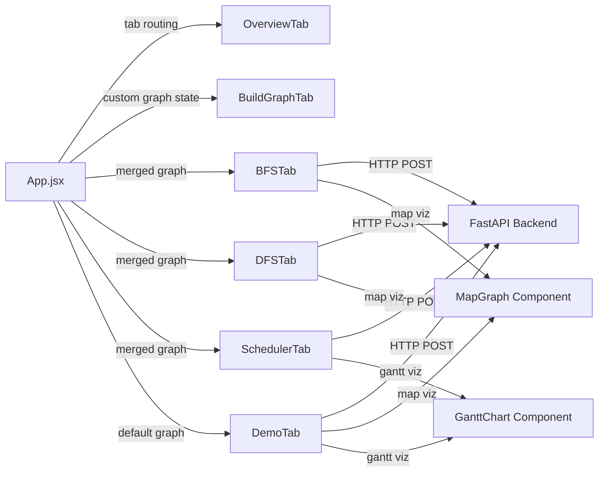

<p align="center">
  
</p>

<h1 align="center">⚡ PacketPath — Grid Fault Management System</h1>

<p align="center">
  <em>Real-time power grid fault detection, shortest-path routing, zone mapping & crew scheduling — visualized on OpenStreetMap</em>
</p>

<p align="center">
  
  
  
  
  
  
</p>

---

## 📑 Table of Contents

- [🔍 Project Overview](#-project-overview)
- [✨ Features](#-features)
- [🏗️ Project Architecture / Workflow](#️-project-architecture--workflow)
- [🛠️ Tech Stack](#️-tech-stack)
- [📂 Folder Structure](#-folder-structure)
- [🚀 Installation & Setup](#-installation--setup)
- [📖 Usage](#-usage)
- [🧮 Algorithms Used](#-algorithms-used)
- [🌐 API Endpoints](#-api-endpoints)
- [📸 Screenshots / Demo](#-screenshots--demo)
- [🔮 Future Enhancements](#-future-enhancements)
- [👥 Contributors](#-contributors)
- [📄 License](#-license)

---

## 🔍 Project Overview

**PacketPath** is a full-stack web application that simulates a **power grid fault management system** for the city of **Bangalore, India**. It demonstrates how classical graph algorithms (BFS, DFS) and operating-system scheduling concepts (Round-Robin) can be applied to solve real-world infrastructure problems — all visualized on an interactive OpenStreetMap.

### 🎯 Problem Statement

When faults occur in a power grid, repair crews need to:

1. **Find the shortest route** from the nearest repair depot to the fault location
2. **Map all affected zones** that lose power due to the fault
3. **Schedule multiple crews fairly** when several faults happen simultaneously

PacketPath solves all three problems using classical algorithms, visualized on a real-world OpenStreetMap of Bangalore with **28 pre-loaded substation locations** and the ability for users to **build their own custom graphs**.

### 💡 What Makes It Unique

| Aspect | Detail |
|--------|--------|
| 🌍 **Real Geography** | Nodes placed at actual Bangalore coordinates (Majestic, Koramangala, Whitefield, Electronic City, etc.) on an interactive OpenStreetMap |
| 🏗️ **Interactive Graph Builder** | Users can click the map to add custom nodes, draw edges with auto-calculated Haversine distances, and run algorithms on their own graph |
| ⚡ **Algorithm Comparison** | Side-by-side BFS vs Brute Force comparison showing why BFS is exponentially faster |
| ⚙️ **OS Concepts Integration** | Round-Robin CPU scheduling applied to crew dispatch with priority boost for critical infrastructure |

---

## ✨ Features

| Feature | Description |
|---------|-------------|
| 🗺️ **OpenStreetMap Integration** | Interactive Leaflet map with dark CARTO tiles, centered on Bangalore |
| 🏗️ **Custom Graph Builder** | Click-to-place nodes, draw edges with auto-calculated Haversine distances, delete nodes/edges |
| 🔵 **BFS Shortest Path** | Breadth-First Search from depot to fault — guarantees minimum hops |
| ⚡ **Brute Force Comparison** | Enumerate all paths to show BFS efficiency advantage |
| 🌊 **DFS Zone Mapping** | Depth-First Search to find all nodes reachable from a fault (affected zones) |
| ⚙️ **Round-Robin Scheduler** | OS-style crew dispatch with configurable time quantum and critical-node priority |
| 📊 **Gantt Chart Visualization** | Interactive timeline showing crew dispatch slots, idle gaps, and completion times |
| 🚀 **Live Demo Mode** | 3 simultaneous faults — runs BFS + DFS + Round-Robin all at once |
| 🌙 **Dark Mode UI** | Premium glassmorphic design with Inter/JetBrains Mono typography |
| 📍 **Map-Click Node Selection** | Pick start/end/fault nodes directly by clicking markers on the map |
| 🔎 **Node Filtering** | Filter map markers by type (Depot / Critical / Substation) |
| 📱 **Responsive Design** | Works across desktop and tablet viewports |

---

## 🏗️ Project Architecture / Workflow

```
┌─────────────────────────────────────────────────────────────────┐
│                        FRONTEND (React + Vite)                  │
│                                                                 │
│  ┌──────────┐  ┌──────────┐  ┌──────────┐  ┌──────────────────┐│
│  │ Overview  │  │  Build   │  │   BFS    │  │   DFS / Sched /  ││
│  │   Tab     │  │  Graph   │  │   Tab    │  │   Demo Tabs      ││
│  └─────┬────┘  └────┬─────┘  └────┬─────┘  └───────┬──────────┘│
│        │            │             │                 │            │
│        └────────────┴──────┬──────┴─────────────────┘            │
│                            │                                     │
│                    ┌───────┴────────┐                             │
│                    │   MapGraph     │  <- Leaflet + OpenStreetMap │
│                    │   Component    │     (react-leaflet)         │
│                    └───────┬────────┘                             │
│                            │                                     │
│                    ┌───────┴────────┐                             │
│                    │   api.js       │  <- HTTP Client             │
│                    └───────┬────────┘                             │
└────────────────────────────┼─────────────────────────────────────┘
                             │  REST API (JSON)
                             │  http://localhost:8000/api/*
┌────────────────────────────┼─────────────────────────────────────┐
│                    ┌───────┴────────┐                             │
│                    │   FastAPI      │  <- Python Backend          │
│                    │   main.py      │                             │
│                    └───────┬────────┘                             │
│                            │                                     │
│          ┌─────────────────┼─────────────────────┐               │
│          │                 │                     │               │
│   ┌──────┴──────┐  ┌──────┴──────┐  ┌───────────┴────┐          │
│   │ BFS Engine  │  │ DFS Engine  │  │ RR Scheduler   │          │
│   │ + Brute     │  │ + Zone Map  │  │ + Gantt Gen    │          │
│   │   Force     │  │             │  │ + Priority Q   │          │
│   └─────────────┘  └─────────────┘  └────────────────┘          │
│                                                                  │
│              BACKEND (FastAPI + Uvicorn)                          │
└──────────────────────────────────────────────────────────────────┘
```

### 📋 Step-by-Step Workflow

1. **App Load** → Frontend fetches the full graph topology from `GET /api/graph`
2. **Overview Tab** → Displays all 28 Bangalore nodes on the OSM map with stats
3. **Build Graph Tab** → User clicks the map to place custom nodes, selects pairs to connect with auto-calculated distances (Haversine formula)
4. **BFS Tab** → User picks a depot (start) and fault (target) → `POST /api/bfs` → Backend runs BFS → Returns shortest path → Frontend highlights path as purple polylines on the map
5. **DFS Tab** → User picks a fault origin → `POST /api/dfs` → Backend runs DFS → Returns all reachable nodes → Frontend highlights affected zone in cyan
6. **Scheduler Tab** → User configures faults with burst times and crews → `POST /api/schedule` → Backend runs Round-Robin → Returns Gantt chart data → Frontend renders interactive Gantt timeline
7. **Live Demo** → Triggers 3 simultaneous faults → Runs BFS + DFS + Round-Robin in one call → Full visualization with fault switching

### 🔄 Module Interactions



---

## 🛠️ Tech Stack

### 🎨 Frontend

| Technology | Version | Purpose |
|------------|---------|---------|
| **React** | 19.2.6 | UI component framework |
| **Vite** | 8.0.12 | Build tool & dev server |
| **react-leaflet** | 5.0.0 | React bindings for Leaflet.js maps |
| **Leaflet.js** | 1.9.4 | OpenStreetMap tile rendering, markers, polylines |
| **CARTO Dark Tiles** | — | Dark-themed map tile layer |
| **D3.js** | 7.9.0 | Data visualization utilities |
| **lucide-react** | 1.16.0 | Icon library |
| **react-force-graph-2d** | 1.29.1 | Force-directed graph rendering |
| **Vanilla CSS** | — | Custom dark-mode design system with CSS variables |
| **Google Fonts** | — | Inter (UI) + JetBrains Mono (code/data) |

### ⚙️ Backend

| Technology | Version | Purpose |
|------------|---------|---------|
| **Python** | 3.10+ | Server-side language |
| **FastAPI** | 0.111.0 | High-performance REST API framework |
| **Uvicorn** | 0.29.0 | ASGI server for FastAPI |
| **Pydantic** | Built-in | Request/response validation |

### 💾 Database

| Type | Details |
|------|---------|
| **In-Memory** | Graph stored as Python dictionaries (`NODES`, `EDGES`, `ADJ`). No external database required. |

> **Note:** The graph is built at server startup. 28 Bangalore nodes are hardcoded, and edges are auto-generated via Haversine distance (threshold: 8.5 km).

---

## 📂 Folder Structure

```
PacketPath/
├── 📁 backend/
│   ├── main.py                 # FastAPI server — all endpoints + algorithms
│   ├── requirements.txt        # Python dependencies (fastapi, uvicorn)
│   └── __pycache__/            # Python bytecode cache
│
├── 📁 frontend/
│   ├── index.html              # Entry HTML — Leaflet CSS, Google Fonts
│   ├── package.json            # Node.js dependencies & scripts
│   ├── vite.config.js          # Vite build configuration
│   ├── eslint.config.js        # ESLint configuration
│   ├── 📁 public/              # Static assets
│   └── 📁 src/
│       ├── main.jsx            # React entry point
│       ├── App.jsx             # Root component — tab routing, state management
│       ├── api.js              # HTTP client — wraps all backend API calls
│       ├── index.css           # Global CSS — dark theme design system (692 lines)
│       ├── 📁 components/
│       │   ├── MapGraph.jsx    # Leaflet OSM map — markers, polylines, popups
│       │   ├── GanttChart.jsx  # Round-Robin Gantt chart with tooltips
│       │   └── PowerGridGraph.jsx  # (Legacy) SVG-based graph renderer
│       └── 📁 tabs/
│           ├── OverviewTab.jsx     # Grid overview + stats
│           ├── BuildGraphTab.jsx   # Interactive graph builder
│           ├── BFSTab.jsx          # BFS shortest path interface
│           ├── DFSTab.jsx          # DFS zone mapper interface
│           ├── SchedulerTab.jsx    # Round-Robin scheduler config
│           └── DemoTab.jsx         # Full demo — 3 faults at once
│
└── README.md                   # This file
```

### 🔑 Key Files Explained

| File | Lines | Role |
|------|-------|------|
| `backend/main.py` | 471 | Contains the entire backend — graph data (28 Bangalore nodes), BFS/DFS/Brute-Force algorithms, Round-Robin scheduler, Haversine edge builder, custom graph helpers, and all REST endpoints |
| `frontend/src/App.jsx` | 128 | Root React component — manages tab state, merges Bangalore default graph with user's custom graph, passes data to all tabs |
| `frontend/src/components/MapGraph.jsx` | 315 | Core map component — renders Leaflet OSM with color-coded CircleMarkers, edge Polylines, click handlers for node selection, builder mode, pulsing fault ring animation, node filtering, and a floating legend |
| `frontend/src/components/GanttChart.jsx` | 154 | Round-Robin Gantt chart — per-fault timeline rows with color-coded bars, idle gap visualization, tick marks, tooltips, and a results data table |
| `frontend/src/index.css` | 692 | Complete dark-mode design system with CSS custom properties, glassmorphic cards, animations, Leaflet dark-theme overrides, responsive breakpoints |
| `frontend/src/api.js` | 29 | Thin HTTP client wrapping `fetch()` calls to `localhost:8000/api/*` |

---

## 🚀 Installation & Setup

### 📋 Prerequisites

| Tool | Version | Check Command |
|------|---------|---------------|
| **Node.js** | 18+ | `node --version` |
| **npm** | 9+ | `npm --version` |
| **Python** | 3.10+ | `python --version` |
| **pip** | Latest | `pip --version` |

### 1️⃣ Clone the Repository

```bash
git clone https://github.com/<your-username>/PacketPath.git
cd PacketPath
```

### 2️⃣ Backend Setup

```bash
# Navigate to backend
cd backend

# Create virtual environment (recommended)
python -m venv venv

# Activate virtual environment
# Windows:
venv\Scripts\activate
# macOS/Linux:
source venv/bin/activate

# Install dependencies
pip install -r requirements.txt

# Start the server
uvicorn main:app --reload --port 8000
```

✅ Backend will be running at **http://localhost:8000**
📚 API docs available at **http://localhost:8000/docs** (Swagger UI)

### 3️⃣ Frontend Setup

```bash
# Navigate to frontend (from project root)
cd frontend

# Install dependencies
npm install

# Start dev server
npm run dev
```

✅ Frontend will be running at **http://localhost:5173**

### 4️⃣ Environment Variables

No environment variables are required. The frontend connects to `http://localhost:8000/api` by default (configured in `src/api.js`).

> **💡 Tip:** If you change the backend port, update the `BASE` constant in `frontend/src/api.js`:
> ```js
> const BASE = 'http://localhost:8000/api';
> ```

---

## 📖 Usage

### 🏙️ Overview Tab
View the complete Bangalore power grid on the map. See stats: total substations, transmission lines, repair depots, critical nodes, and total grid coverage in km.

### 🏗️ Build Graph Tab
1. Click **"Add Node"** → Click anywhere on the map to place a new node
2. Enter a label and select node type (depot / substation / critical)
3. Click **"Connect"** → Click two nodes to create an edge (distance auto-calculated via Haversine)
4. Click **"Delete"** → Click a node to remove it and its edges
5. Your custom graph merges with the Bangalore preset for BFS/DFS

### 🔵 BFS Pathfinder
1. Select a **Depot** (start) — or leave on "Auto" to use the nearest depot
2. Select a **Fault** (target) — any substation experiencing a fault
3. *(Optional)* Click **"Pick on Map"** buttons to select nodes visually
4. Click **"Run BFS"**
5. Results: path highlighted in purple on the map, hop count, nodes explored, execution time
6. *(Optional)* Enable **Brute Force Compare** to see side-by-side performance

**Example Input/Output:**
```
Input:  Depot = D1 (BESCOM Rajajinagar depot), Fault = S14 (JP Nagar Substation)
Output: Path = D1 → S4 → S6 → S14 (3 hops, 0.02ms)
        Real Distance: 12.4 km
```

### 🌊 DFS Zone Mapper
1. Select a **Fault Origin** node
2. Click **"Run DFS"**
3. Results: all reachable nodes highlighted in cyan, traversal order, percentage of grid affected

### ⚙️ Round-Robin Scheduler
1. Configure fault entries: ID, node, crew name, burst time (repair minutes), arrival time
2. Set the **Time Quantum** (default: 3 min)
3. Click **"Run Round-Robin"**
4. Results: interactive Gantt chart, per-fault completion/turnaround/waiting times

### 🚀 Live Demo
1. Click **"Launch Full Demo"**
2. 3 simultaneous faults auto-triggered:
   - **F1:** Bowring Hospital (S1) — ★ Critical, Crew-Alpha, 8 min
   - **F2:** Marathahalli (S10) — Standard, Crew-Bravo, 5 min
   - **F3:** Yelahanka (S19) — Standard, Crew-Charlie, 10 min
3. Click fault cards to switch between BFS path views on the map
4. Gantt chart shows crew scheduling across all 3 faults

---

## 🧮 Algorithms Used

### 1. 🔵 Breadth-First Search (BFS)

**Purpose:** Find the shortest path (minimum hops) between a repair depot and a fault substation.

**How it works:**
- Uses a FIFO queue (`collections.deque`) to explore nodes level-by-level
- Maintains a `visited` dictionary mapping each node to its parent
- The first time it reaches the target guarantees the shortest path (unweighted)
- Supports both the hardcoded Bangalore graph and user-supplied custom graphs

**Implementation:** `backend/main.py` → `bfs_shortest_path()` + `bfs_on_adj()`

```
Time Complexity:  O(V + E)  — where V = nodes, E = edges
Space Complexity: O(V)      — for the visited dictionary + queue
```

---

### 2. 🌊 Depth-First Search (DFS)

**Purpose:** Map all zones (nodes) affected by a power fault — find the entire connected component.

**How it works:**
- Uses recursive stack to explore as deep as possible before backtracking
- Supports **blocker nodes** that act as circuit breakers (stops DFS propagation)
- Returns traversal order for step-by-step visualization on the map

**Implementation:** `backend/main.py` → `dfs_affected_zones()` + `dfs_on_adj()`

```
Time Complexity:  O(V + E)
Space Complexity: O(V)      — recursion stack + visited set
```

---

### 3. ⚡ Brute Force Path Enumeration

**Purpose:** Enumerate ALL possible paths between two nodes to compare against BFS efficiency.

**How it works:**
- Recursive DFS with backtracking to explore every possible path
- Tracks the shortest path found across all explorations
- **Depth-limited** (max depth = 10) to prevent exponential blowup on large graphs

**Implementation:** `backend/main.py` → `brute_force_path()`

```
Time Complexity:  O(V!)     — worst case (all permutations)
Space Complexity: O(V)      — recursion depth
```

> ⚠️ **Warning:** Brute Force is intentionally inefficient — it exists to demonstrate *why* BFS is the better algorithm.

---

### 4. ⚙️ Round-Robin Scheduling (OS Concept)

**Purpose:** Fairly dispatch repair crews across multiple simultaneous faults.

**How it works:**
- Each fault gets a fixed time quantum (e.g., 3 minutes) before being preempted
- **Critical nodes** (hospitals, water treatment, fire services) are priority-boosted to the front of the queue
- Faults are sorted by `(critical_priority, arrival_time)` for initial ordering
- Tracks arrival, completion, turnaround, and waiting times per fault
- Generates Gantt chart data showing time slices allocated to each crew
- Includes a safety limit of 500 iterations to prevent infinite loops

**Implementation:** `backend/main.py` → `run_round_robin()`

```
Time Complexity:  O(n × total_burst / quantum)  — n = number of faults
Space Complexity: O(n)
```

---

### 5. 📐 Haversine Distance Formula

**Purpose:** Calculate real-world distance (in km) between two lat/lon coordinates for edge weights.

**Formula:**
```
a = sin²(Δlat / 2) + cos(lat₁) × cos(lat₂) × sin²(Δlon / 2)
d = 2R × arcsin(√a)    where R = 6,371 km (Earth's radius)
```

**Usage:** Edges between nodes within **8.5 km** threshold are auto-connected at startup. Also used to calculate real distances for BFS paths and for custom graph edge creation.

**Implementation:** `backend/main.py` → `haversine()` + `build_edges()`

---

## 🌐 API Endpoints

All endpoints are served at `http://localhost:8000/api/`

Interactive Swagger docs: **http://localhost:8000/docs**

| Method | Endpoint | Description |
|--------|----------|-------------|
| `GET` | `/api/graph` | Returns full graph topology — all nodes (with lat/lng/type/area) and edges (with weights) |
| `GET` | `/api/nodes` | Returns only the nodes dictionary |
| `POST` | `/api/bfs` | Runs BFS shortest path. Body: `{ depot?, fault, use_brute_force?, custom_nodes?, custom_edges? }` |
| `POST` | `/api/dfs` | Runs DFS zone mapping. Body: `{ fault, blockers?, custom_nodes?, custom_edges? }` |
| `POST` | `/api/schedule` | Runs Round-Robin scheduler. Body: `{ faults: [...], time_quantum }` |
| `POST` | `/api/demo` | Runs full demo (3 faults). Body: `{ time_quantum }` |
| `GET` | `/` | Health check — returns API status + docs link |

### 📬 Example API Calls

**BFS Shortest Path:**
```bash
curl -X POST http://localhost:8000/api/bfs \
  -H "Content-Type: application/json" \
  -d '{"depot": "D1", "fault": "S14", "use_brute_force": true}'
```

**Response:**
```json
{
  "algorithm": "BFS",
  "depot": "D1",
  "fault": "S14",
  "path": ["D1", "S4", "S6", "S14"],
  "hops": 3,
  "nodes_explored": 8,
  "total_km": 12.4,
  "time_ms": 0.0234,
  "brute_force": {
    "path": ["D1", "S4", "S6", "S14"],
    "hops": 3,
    "paths_explored": 847,
    "time_ms": 1.245
  }
}
```

**Round-Robin Scheduling:**
```bash
curl -X POST http://localhost:8000/api/schedule \
  -H "Content-Type: application/json" \
  -d '{
    "faults": [
      {"id": "F1", "node": "S1", "burst": 8, "arrival": 0, "crew": "Alpha"},
      {"id": "F2", "node": "S14", "burst": 5, "arrival": 1, "crew": "Bravo"}
    ],
    "time_quantum": 3
  }'
```

**DFS Zone Mapping:**
```bash
curl -X POST http://localhost:8000/api/dfs \
  -H "Content-Type: application/json" \
  -d '{"fault": "S1", "blockers": ["S3"]}'
```

---

## 📸 Screenshots / Demo

> **Screenshots can be added here.** To add screenshots:
> 1. Run the application locally
> 2. Navigate to each tab and capture the UI
> 3. Save images in a `screenshots/` directory
> 4. Reference them below:

```markdown


```

### 🖼️ Key Views to Capture

| View | Description |
|------|-------------|
| **Overview** | Bangalore OSM map with all 28 nodes + grid stats |
| **Build Graph** | Custom node placement on the map with connect/delete modes |
| **BFS Path** | Purple path highlighted between depot and fault on OSM |
| **BFS vs Brute Force** | Side-by-side comparison cards showing efficiency difference |
| **DFS Zones** | Cyan-highlighted affected zone with pulsing fault ring |
| **Gantt Chart** | Round-Robin timeline with color-coded crew bars and tooltips |
| **Live Demo** | 3-fault scenario with fault card switcher and combined results |

---

## 🔮 Future Enhancements

### 📈 Algorithm Improvements
- **Dijkstra's Algorithm** — Weighted shortest path using actual km distances instead of hop count
- **A\* Search** — Heuristic-based pathfinding for faster convergence on large graphs
- **Minimum Spanning Tree (Prim/Kruskal)** — Optimal grid network design
- **Bellman-Ford** — Handle negative edge weights for cost modeling

### 🆕 Feature Additions
- **Real-time Fault Simulation** — WebSocket-based live fault injection with animated propagation
- **Multi-City Support** — Switch between Bangalore, Delhi, Mumbai, Chennai, etc.
- **Graph Persistence** — Save/load custom graphs to a database (PostgreSQL / MongoDB)
- **User Authentication** — Login system for saving personal graph configurations
- **Route Animation** — Animated crew movement along the BFS path on the map
- **Weighted Round-Robin** — Different time quantums for critical vs standard faults
- **Export Reports** — PDF/CSV export of scheduling results and path analysis

### 📊 Scalability
- **Database Backend** — Move from in-memory to PostgreSQL with PostGIS for geospatial queries
- **Redis Caching** — Cache frequently accessed graph topologies
- **Docker Deployment** — Containerize frontend + backend for one-click deployment
- **CI/CD Pipeline** — GitHub Actions for automated testing and deployment
- **Load Testing** — Handle 1000+ node graphs with optimized adjacency structures

---

## 👥 Contributors

<!-- Add your team members here -->

| Name | Role | GitHub |
|------|------|--------|
| *Your Name* | Full Stack Developer | [@your-handle](https://github.com/your-handle) |

> 🤝 Contributions are welcome! Feel free to open issues or submit pull requests.

---

## 📄 License

This project is licensed under the **MIT License** — see the [LICENSE](LICENSE) file for details.

```
MIT License

Copyright (c) 2025 PacketPath Contributors

Permission is hereby granted, free of charge, to any person obtaining a copy
of this software and associated documentation files (the "Software"), to deal
in the Software without restriction, including without limitation the rights
to use, copy, modify, merge, publish, distribute, sublicense, and/or sell
copies of the Software, and to permit persons to whom the Software is
furnished to do so, subject to the following conditions:

The above copyright notice and this permission notice shall be included in all
copies or substantial portions of the Software.
```

---

<p align="center">
  Built with ❤️ using React, FastAPI, and OpenStreetMap
</p>

<p align="center">
  <strong>⚡ PacketPath</strong> — Making power grid management smarter, one algorithm at a time.
</p>
